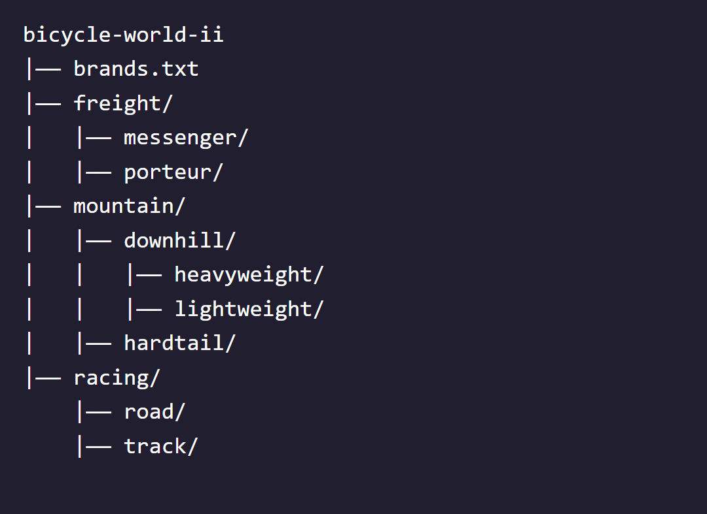

# Bicycle World
Welcome to Bicycle World, the premier text-based bicycle shop! This shop is only accessible to programmers like you, who are familiar with the command line.

In this project, you’ll use the commands you learned to navigate and edit the filesystem of this special shop.

The starting filesystem is shown below. (Bicycle World recently changed owners, who named the main directory bicycle-world-ii.)



### 1. Print the working directory.
```bash
$ pwd
/home/ccuser/workspace/bicycle-world-ii
```

### 2. List the files and directories in the working directory.
```bash
$ ls
brands.txt  freight  mountain  racing
```

### 3. Change directories to the freight/ directory.
```bash
$ cd freight/
```

### 4. List the files and directories in the working directory.
```bash
$ ls
messenger  porteur
```

### 5. Change directories to the porteur/ directory.
```bash
$ cd porteur/
```

### 6. Change directories up two levels to the bicycle-world-ii/ directory and list the files and directories
```bash
$ cd ../..
$ ls
brands.txt  freight  mountain  racing
```

### 7. Change directories to the mountain/downhill/ directory.
```bash
$ cd mountain/downhill/
```

### 8. Make a file called dirt.txt.
```bash
$ touch dirt.txt
```

### 9. Make a file called mud.txt.
```bash
$ touch mud.txt
```

### 10. List the files and directories in the downhill/ directory.
```bash
$ ls
dirt.txt  heavyweight  lightweight  mud.txt
```

### 11. Downhill biking is dangerous: In the downhill/ directory, make a directory called safety/.
```bash
$ mkdir safety
```

### 12. Change directories to the bicycle-world-ii/ directory.
```bash
$ cd ../..
```

### 13. List the contents of the bicycle-world-ii/ directory.
```bash
$ ls
brands.txt  freight  mountain  racing
```

### 14. The shop is adding a new type of bike! In bicycle-world-ii/, make a directory called bmx/.
```bash
$ mkdir bmx
```

### 15. Without changing directories from bicycle-world-ii/, make a file in the bmx/ directory called tricks.txt.
```bash
$ touch bmx/tricks.txt
```

### 16. List all files and directories in the current directory.
```bash
$ ls
bmx  brands.txt  freight  mountain  racing
```
