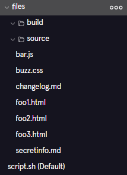
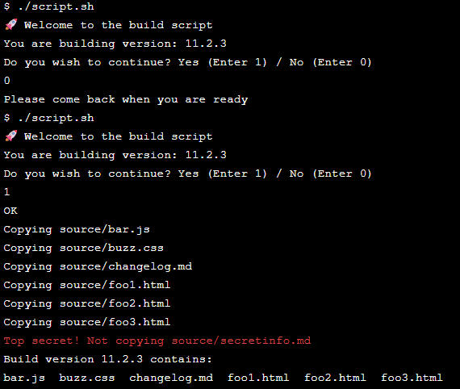

# Build a Build Script
One common use of bash scripts is for releasing a 'build' of your source code. Sometimes your private source code may contain developer resources or private information that you don’t want to release in the published version.

In this project, you’ll create a release script to copy certain files from a source directory into a build directory.


## Start the script
### 1. Add a header to script.sh
Take a look at the build and source folders. The objective of our script is to copy files from source to build, with a couple of exceptions and modifications.



Add a header to script.sh, identifying the type of script.
```bash
#!/bin/bash
```

### 2.  Let’s welcome the user to the script 
```bash
echo "Welcome to the build script"
```

Terminal test:
```bash
$ ./script.sh
Welcome to the build script
```


### 3. Read line into variable
Since we are creating a new build, let’s verify with the user that they have updated changelog.md with the current release version.

The first line of the file contains a version number with markdown formatting like so: `## 1.1.1`.
Read the first line of this file into the variable firstline using command substitution.

```bash
firstline=$(head -n 1 source/changelog.md)
echo $firstline
```

Terminal test:
```bash
$ ./script.sh
Welcome to the build script
## 11.2.3
```


### 4. Split line
We only want the version number without the markdown formatting, so split the string firstline into the array splitfirstline.

```bash
read -a firstlinesplit <<< $firstline
```


### 5. Set the script version value
Now we are ready to set the value of the version of the script located in index 1 of the array splitfirstline and save it to the variable version. Delete the previous print statement. 
Print a statement to the terminal notifying the user of the version they are building.

```bash
version=${firstlinesplit[1]}
echo "You are building version: $version"
```

Terminal Test:
```bash
$ ./script.sh
Welcome to the build script
You are building version: 11.2.3
```


## User Input
### 6. Add an escape
Let's give the user a chance to exit the script if they need to make a change to the version.
Ask the user to enter 1 (for yes) to continue and 0 (for no) to exit and assign their response to the variable versioncontinue.

```bash
echo "Do you wish to continue? Yes (Enter 1) / No (Enter 0)"
read versioncontinue
```


### 7. Add a conditional 
If the user said 1 to the continue question, we will execute the rest of our script. For now, respond “OK”. If the user did not, tell them “Please come back when you are ready”.

```bash
if [ $versioncontinue -eq 1 ]
then
  echo "OK"
else
  echo "Please come back when you are ready"
fi
```

Terminal Test:
```bash
$ ./script.sh
Welcome to the build script
You are building version: 11.2.3
Do you wish to continue? Yes (Enter 1) / No (Enter 0)
0
Please come back when you are ready
$ ./script.sh
Welcome to the build script
You are building version: 11.2.3
Do you wish to continue? Yes (Enter 1) / No (Enter 0)
1
OK
```


## Copying files
### 8. Copy every file from source to build except for secretinfo.md
Within the positive conditional (where we told the user “OK”), start by iterating over all the files in the source directory and printing their names to the terminal.

```bash
if [ $versioncontinue -eq 1 ]
then
  echo "OK"
  for filename in source/*
  do
    echo $filename
  done
else
  echo "Please come back when you are ready"
fi
```

Terminal Test:
```bash
Welcome to the build script
You are building version: 11.2.3
Do you wish to continue? Yes (Enter 1) / No (Enter 0)
1
OK
source/bar.js
source/buzz.css
source/changelog.md
source/foo1.html
source/foo2.html
source/foo3.html
source/secretinfo.md
```


### 9. Check filename
Check if the filename is "source/secretinfo.md". If it is, inform the user that it is not being copied. Otherwise, inform the user that it is being copied.

```bash
if [ $versioncontinue -eq 1 ]
then
  echo "OK"
  for filename in source/*
  do
    if [ "$filename" == "source/secretinfo.md" ]
      then 
        echo "Top secret! Not copying $filename"
      else 
        echo "Copying $filename" 
    fi     
  done
else
  echo "Please come back when you are ready"
fi
```

Terminal Test:
```bash
$ ./script.sh
Welcome to the build script
You are building version: 11.2.3
Do you wish to continue? Yes (Enter 1) / No (Enter 0)
1
OK
Copying source/bar.js
Copying source/buzz.css
Copying source/changelog.md
Copying source/foo1.html
Copying source/foo2.html
Copying source/foo3.html
Top secret! Not copying source/secretinfo.md
```


### 10. Copy file into build directory
Now we can actually copy the files. After informing the user the file is being copied, copy the file into the build directory.

```bash 
if [ $versioncontinue -eq 1 ]
then
  echo "OK"
  for filename in source/*
  do
    if [ "$filename" == "source/secretinfo.md" ]
      then 
        echo "Top secret! Not copying $filename"
      else 
        echo "Copying $filename"
        cp "$filename" build/.
    fi     
  done
else
  echo "Please come back when you are ready"
fi
```

Terminal Test:
```bash
$ ls build/
$ ./script.sh
Welcome to the build script
You are building version: 11.2.3
Do you wish to continue? Yes (Enter 1) / No (Enter 0)
1
OK
Copying source/bar.js
Copying source/buzz.css
Copying source/changelog.md
Copying source/foo1.html
Copying source/foo2.html
Copying source/foo3.html
Top secret! Not copying source/secretinfo.md
$ ls build/
bar.js  buzz.css  changelog.md  foo1.html  foo2.html  foo3.html
```


## Listing files
### 11. Change directory
The final thing we want to do is list the files in the build directory for the user.

Outside of the loop over the filenames in the directory, use the script to change the directory to the build directory. So that we don’t forget, also add the command to change back to the directory with the script.

``` bash
cd build/
# Code goes here
cd ..
```


### 12. Add code to notify the user what files are currently in the build directory
Be sure to reference the version in your message.

```bash
  cd build/
  echo "Build version $version contains:"
  ls
  cd ..
```

Terminal Test:
```bash
$ ./script.sh
Welcome to the build script
You are building version: 11.2.3
Do you wish to continue? Yes (Enter 1) / No (Enter 0)
1
OK
Copying source/bar.js
Copying source/buzz.css
Copying source/changelog.md
Copying source/foo1.html
Copying source/foo2.html
Copying source/foo3.html
Top secret! Not copying source/secretinfo.md
Build version 11.2.3 contains:
bar.js  buzz.css  changelog.md  foo1.html  foo2.html  foo3.html
```


### 13. Play around with the build script
You now have a build script for this repository. Feel free to play around with making it more robust.

Give the script more character with emojis:
```bash
echo "🚀  Welcome to the build script"
```

Let's change the top secret text colour to red with ANSI escape codes:
`-e` to interpret escape sequences, `\e[31m` to set text colour to red, `\e[0m` to reset formatting and let's add a ding with `\a`:

```bash
echo -e "\e[31mTop secret! Not copying $filename\a\e[0m" 
```

The contents of secretinfo.md is the line `The answer is 42.`. Let's copy secretinfo.md but replace '42' with 'XX'. Delete the line `echo "Top secret! Not copying $filename"` and replace it with:

```bash 
echo "Top secret!"
echo "The answer is XX" > "$filename"
echo "Copying $filename" 
cp "$filename" build/.
```

Future improvements to explore:
- Add error checking (check if a file exists before copying).
- Log actions to a file.
- Add a progress bar or spinner.
- Add more user prompts and confirmations.
- Add a summary at the end with counts of files copied or skipped.


### Final Script
```bash
#!/bin/bash
echo "🚀  Welcome to the build script"

firstline=$(head -n 1 source/changelog.md)
read -a splitfirstline <<< $firstline
version=${splitfirstline[1]}
echo "You are building version: $version"

echo "Do you wish to continue? Yes (Enter 1) / No (Enter 0)"
read versioncontinue

if [ $versioncontinue -eq 1 ]
then
  echo "OK"
  for filename in source/*
  do
    if [ "$filename" == "source/secretinfo.md" ]
      then 
        echo -e "\e[31mTop secret! Not copying $filename\a\e[0m" 
        #echo "Top secret!"
        #echo "The answer is XX" > "$filename"
        #echo "Copying $filename" 
        #cp "$filename" build/.
      else 
        echo "Copying $filename" 
        cp "$filename" build/.
    fi     
  done
  cd build
  echo "Build version $version contains:"
  ls
  cd ..
else
  echo "Please come back when you are ready"
fi
```


### Final Terminal Test
